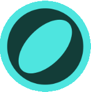
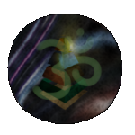

    
    
    

    <h1>Quickswap Liquidity Checker</h1>
    <h3>Liquidity Verification for USDGLO/OMMM on Polygon</h3>

---

## 🌟 Overview  
This app verifies that students have **supplied liquidity** in the **correct price range** and **amount** before they can lock their LP token with the school.  

Once their liquidity is **verified and locked**, they will gain access to:  
- 🗓 **The Class Schedule**  
- 🎥 **A Video Conference Link**  

---

## 🔎 How It Works  

### **1️⃣ Enter Your Liquidity Token ID**  
- Students enter their **NFT Liquidity Position ID** in the app.  
- Click **"Check Token"** to verify whether their position meets the requirements.  

### **2️⃣ App Checks for the Following Conditions:**  

#### ✅ **Correct Price Ranges**  
- **Token 1 (Infinity Range):**  
  - Must be **open from 0 → ∞**  
- **Token 2 (Targeted Range):**  
  - Must be between **0.044430 – 1.081118**  

#### ✅ **Correct Liquidity Amounts**  
- **Token 1 (Infinity Range):**  
  - Must be **between $50 – 600 Ommm**  
- **Token 2 (Targeted Range):**  
  - Must be **between $50 – 1606 Ommm**  

### **3️⃣ Eligibility Status**  
- If both tokens **meet the range and liquidity conditions**, students will see:  
  ✅ **"Eligible for Class"**  
- If **any requirement is not met**, students will see:  
  ❌ **"Not Eligible - Adjust Liquidity or Range"**  

---

## 🔑 Locking Your Liquidity Position  
This app will soon allow students to **lock their LP token** in a **smart contract with the school**.  
- Once locked, they will receive **a video conference link and the class schedule**.  
- This ensures students **actively participate in DeFi** before attending lessons.  

---

## 📜 License  
This project is open-source and licensed under **MIT**.  

    
    
    
    

 ☂️   
⚸🧞‍♂️ Verifying Liquidity for a Smarter Future

